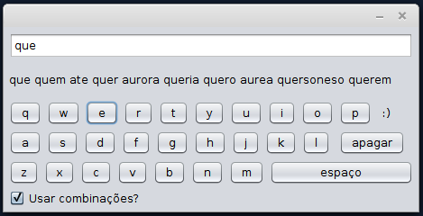

# Teclado Virtual

A virtual keyboard that simulates the intelligent writing of smartphones.

There's a dictionary that powers the suggestions.

When the dictionary is loaded with a word we have a root node, the first letter of the word is added to that root node, the second letter is added to the first letter node, and so on.

That dictionary strucure is a trie, implemented with hash maps, we call it a TrieHash.

A TrieHash is composed by a hashmap of the current letter and a TrieHash, a list of words (that match the first node to the current one) and the number of occurences of the current word.

The list of suggestions need to be sorted by the number of occurences to show the most relevant suggestions first, we use the Java API sort due to being better than our implementation of other sort algorithms like QuickSort.
